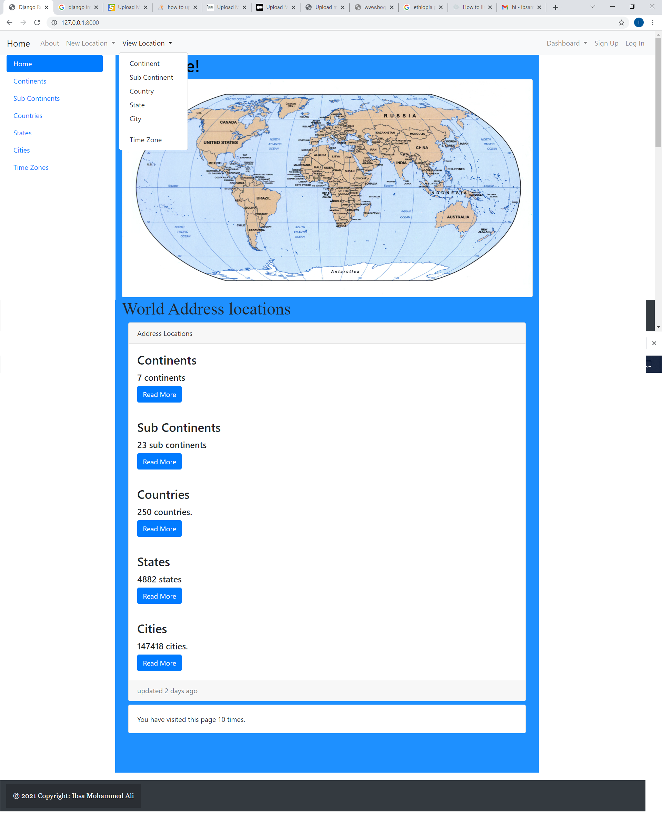
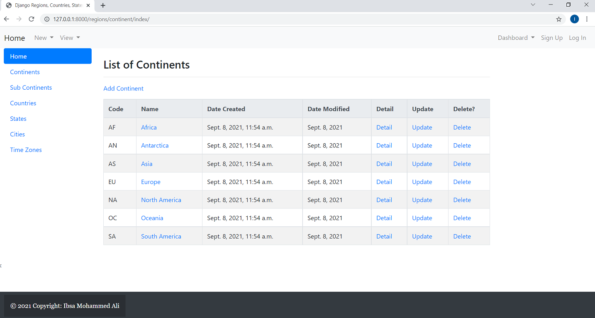
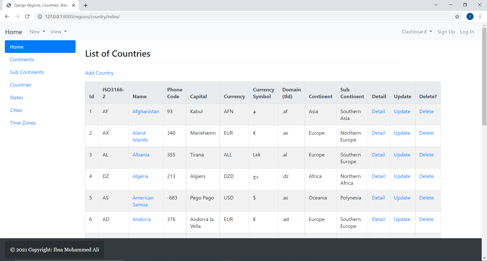

# A Django Country location.

Country location and database Project.

## Screenshots

|     Home    |       Continents      |       Countries          |
| ------------|-----------------------|--------------------------|
|  |  |  |

## Functionality

- Import, create, edit, view  and delete continent data
- Import, create, edit, view  and delete sub continental data
- Import, create, edit, view  and delete countries data
- Import, create, edit, view  and delete states data
- Import, create, edit, view  and delete cities data


### Clone the project

```
git clone https://github.com/aliibsamohammed/django_country_location
cd django_country_location
```

### Install dependencies & activate virtualenv

```
pip install pipenv

pipenv install
pipenv shell
```

### Configure the settings (connection to the database, connection to an SMTP server, and other options)

1. Edit `location/settings.py`


### Apply migrations

```
python location/manage.py migrate
```
Import country data from location/data/
### Collect static files (only on a production server)

```
python location/manage.py collectstatic
```

### Running

#### A development server

Just run this command:

```
python location/manage.py runserver
```